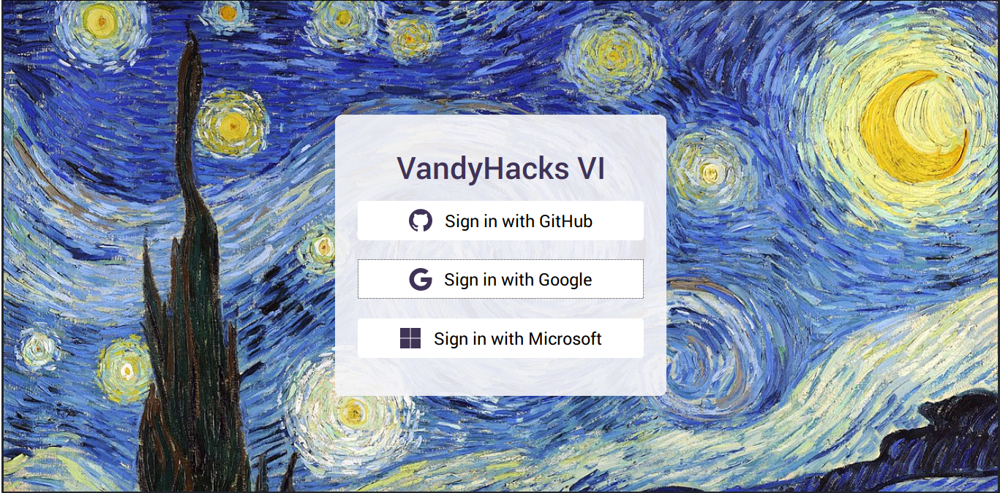
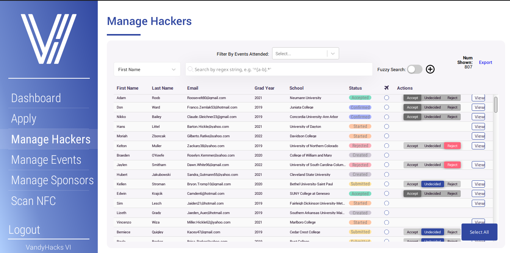
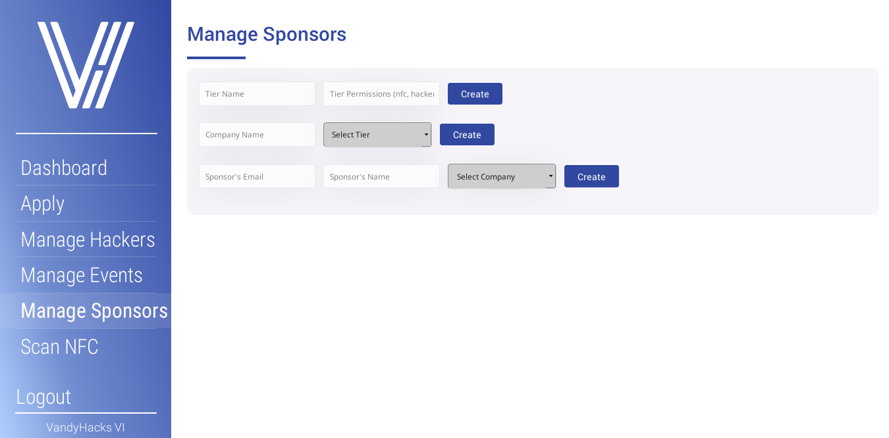

# Vaken

A next-gen hackathon registration system.

## Features

- Full hacker view and management system
- Create and edit sponsors
- Create and edit events, with Google Calendar integration
- Supports storing NFC IDs for hackers, compatible with most NFC scanners/wristbands/cards.
	- Supports tracking event attendance when scanning hackers into events
- Sends emails via AWS SES for hacker acceptances automatically
- Stores resumes in GCP
- [WIP] Dashboard with detailed statistics for organizers

### User Roles
- Organizer (Admin)
    - see hacker management view below
    - can scan NFC
- Volunteer
    - can scan people into events via NFC or manual search mode
- Mentor
- Hacker
	- can create and update application
    - see current application status
    - can RSVP after acceptance
- Sponsor
	- supports permissions based on tier and company

## Tooling

- TypeScript
- GraphQL via Apollo
- React
- React-Router
- Styled Components
- Immer
- Passport
- Express

# Screenshots

### Login Page

    - supports GitHub, Google, and Microsoft SSO logins

### Detailed Hacker Management for Organizers

    - view individual hacker applications
    - fuzzy search + filter by various fields (first name, last name, email, school, grad year)
        - can have multiple search fields
    - filter by events attended
    - accept/reject hacker applications
    - export filtered hacker data to .csv

### Sponsors Management

    - create sponsorship tiers, and set permissions
    - create companies, associate with a tier
    - create sponsors, associate with a company

## Contributing

All contributions are welcome. Please read [CONTRIBUTING.md](./CONTRIBUTING.md) for setup and development instructions.

## Customizing for your event
- constants: [./src/common/constants.json](./src/common/constants.json)
- application questions: [./src/client/assets/application.js](./src/client/assets/application.js)
- strings: [./src/client/assets/strings.json](./src/client/assets/strings.json)
- email templates: [./src/server/mail/templates](./src/server/mail/templates)

## Git Flow

This repository follows the [gitflow workflow](https://www.atlassian.com/git/tutorials/comparing-workflows/gitflow-workflow) designed around ensuring that features end up in the main branch and event deploy-specific customizations end up in event/* branches. When committing or submitting PRs to this repository, please make sure to read the gitflow link above (note 4. below for specific guidance regarding differences in our setup) and remember these key guidelines:

1. Use `git rebase <branch>` rather than pull or merge, always. This will make sure that there is a linear history which is essential when updating the core featureset of vaken while there is an event/* deployment. When exclusively using rebase instead of pull, updating the event/production branch with new features from main is as simple as running `git checkout event/<name> && git rebase main`.
2. When rebasing a branch that is already in GitHub, you will need to `git push --force` when pushing to GitHub. This is because the process of rebasing changes the commit hash of the commits you made previously, so to GitHub they look like different things. This is expected in a rebase-only repository setup. If you try to `push` without the `--force`, it will be rejected and may warn you about work in the remote that is not in your local branch. Use `git log --oneline origin/<branchname>` to ensure that nobody has committed anything new since the rebase (e.g. compare to `git log --oneline` and the top commit from `origin/<branchname>` should be in your local branch), then commence `git push --force`. If you _don't_ have all the work from the remote, then you can either `git cherry-pick <remote commit hash>` to add it to the top of your local branch or, if you have made your own commits to the branch in addition to rebasing, `git rebase origin/<branchname>` again to get the new commits.
3. Always PR feature updates to `main`. The main branch should have all new features, bug fixes, and dep updates. These commits should only make their way to `event/` branches by the process mentioned in tip 1. The reason for this is that we want to make our changes available to everyone using this repository as a base for their hackathon's systems, and having important features in an event/ branch requires them to sift through countless customizations for VandyHacks's own needs. rather than being able to deploy their own event from the main branch.
4. Our model of gitflow centers around the `main` branch being the canonical version of "vaken". `event/` branches should be deployed to production (VandyHacks uses a Hobbyist dyno from Heroku) and should contain all of the customizations to branding and application info for a specific event. Why? It's simple: we have different needs for virtual events and physical events, and rather than duplicate all of the effort to customize vaken for different events, being able to create a draft PR and see every single change required for a "completed" deploy from main makes the process of deploying a future event trivial in comparison to doing it the first time. Let's stop trying to reinvent the wheel!
5. Event/production branches should never be merged back to `main`. If it's something that you might want to use for a future event (or something another hackathon could use), put it in `main`.

## Deploying

> If you have not read the Git Flow section, you should do so first.

Vaken was designed with simplicity of deploy in mind, but implementations always differ from the original design! As a result, we have a hard dependency on at least one cloud provider and soft dependencies in a full-featured setup of as many as five plus some individual service providers! We're always looking for PRs to help tame this beast. PRs to migrate our current hard-coded providers to separate interfaces and implementations are welcome. In the meantime, here's a step-by-step guide for how you can deploy Vaken:

### Required setup
1. Set at least one OAuth provider (we use both GitHub and Google in `main`).
   a. For Google: Follow the [Create Authorization Credentials](https://developers.google.com/identity/sign-in/web/sign-in#create_authorization_credentials) section of Google's official guide (skipping the other sections) and fill in the `GOOGLE_CALLBACK_URL`, `GOOGLE_CLIENT_ID`, and `GOOGLE_CLIENT_SECRET` as environment variables with the information you input/received from Google.
   b. For GitHub: Follow GitHub's instructions for [creating a GitHub app](https://developer.github.com/apps/building-github-apps/creating-a-github-app/). Your app will not need any special permissions. Set the env vars `GITHUB_CALLBACK_URL`, `GITHUB_CLIENT_ID`, and `GITHUB_CLIENT_SECRET` with what you input/received from GitHub.
   c. Alternatively, we have also written support for Sign In with Microsoft, but when it was written fall 2019 the passport integration was poor and the upstream plugin author did not accept PRs. Instructions for setting up Azure can be found on [Microsoft Azure's website](https://docs.microsoft.com/en-us/azure/active-directory/develop/quickstart-register-app), and the `MSFT_CLIENT_ID`, `MSFT_CLIENT_SECRET`, `MSFT_REDIRECT_URL`, and `MSFT_TENANT_NAME` are the env vars you're looking for. Using this provider will require adding an entry in [server/index.ts](https://github.com/VandyHacks/vaken/blob/439025cad805914bd4ae0a6d8acc952f47252a6b/src/server/index.ts#L110) to add the auth provider ([server/auth/microsoft.ts](https://github.com/VandyHacks/vaken/blob/439025cad805914bd4ae0a6d8acc952f47252a6b/src/server/auth/microsoft.ts)) routes and a button in the frontend [OAuthLogin component](https://github.com/VandyHacks/vaken/blob/439025cad805914bd4ae0a6d8acc952f47252a6b/src/client/routes/login/OAuthLogin.tsx#L17). PRs to make this a plugin appreciated!
2. Set up a database (MongoDB) provider. You can use any provider you want (VandyHacks uses MongoDB Atlas Free), then put in the full connection string in MONGODB_BASE_URL env variable. Instructions for MongoDB Atlas can be found on [their site](https://docs.atlas.mongodb.com/getting-started/) (if you're going to use Heroku, you'll probably want to disable IP address allowlisting, as Heroku uses ephemeral IPs). Apparently, some big shopping giant with a large cloud provider created a compatible implementation of mongodb on their cloud that would also work, if you prefer.
3. Set up a server host (VandyHacks uses a Heroku Hobbyist dyno). These instructions on [Deploying to Heroku with Git](https://devcenter.heroku.com/articles/git#deploying-code) will get you there. The free dyno is sufficient resource-wise but goes to sleep (with a several-second cold boot) after 30 minutes of inactivity. Since [53% of visitors leave a site if it takes more than 3 seconds to load](https://www.blog.google/products/admanager/increase-speed-of-your-mobile-site-wi/), the sleeping dyno was a problem for us, and our generous sponsors make $7 a month totally doable. You can set up a custom domain using [these instructions](https://devcenter.heroku.com/articles/custom-domains).

### Optional setup

1. Set up Amazon SES for sending automated emails
   - We use Amazon SES because it's cheap and allows for sending thousands of emails a day. If you run a small event (< 500 applicants), you might fit in under the limits of Office 365/Zoho/Gmail/etc. and can set up nodemailer. If you want to set up SES, instructions can be found on the [AWS Docs site](https://docs.aws.amazon.com/ses/latest/DeveloperGuide/quick-start.html). You'll almost certainly want to [remove the sandbox limitations](https://docs.aws.amazon.com/ses/latest/DeveloperGuide/request-production-access.html), as well. The env vars you'll want to set are `AWS_REGION`, `AWS_ACCESS_KEY`, and `AWS_SECRET_ACCESS_KEY` (the overview for getting these is [here](https://docs.aws.amazon.com/ses/latest/DeveloperGuide/get-aws-keys.html)).
2. Set up GCP Storage for holding resumes
   - We use GCP signed URLs for resumes which expire after a week for security (you can change this in [server/storage/gcp.ts](https://github.com/VandyHacks/vaken/blob/439025cad805914bd4ae0a6d8acc952f47252a6b/src/server/storage/gcp.ts#L38)). GCP was the easiest to set up, and requires `BUCKET_NAME` and `GCP_STORAGE_SERVICE_ACCOUNT` to be set. The service account should be the json string as one line either quoted or with spaces removed. The [GCP Storage Quickstart](https://cloud.google.com/storage/docs/quickstart-console) walks through setting up a bucket, and [Creating and Managing Service Accounts](https://cloud.google.com/iam/docs/creating-managing-service-accounts) will walk you through setting up a service account (it will need the roles/storage.objectAdmin role, which can be set using [these instructions](https://cloud.google.com/iam/docs/granting-changing-revoking-access)).
3. Set up Sentry for real-time reporting of errors users experience
   - The [Heroku Sentry add-on](https://devcenter.heroku.com/articles/sentry) is free and works really well for monitoring whether or not our application has any issues in prod we didn't catch before deploying. The `SENTRY_DSN` environment var should be set with your app's specific endpoint.
4. Set up a Google Calendar for event integration
   - Set `CALENDARID` env var (these [third party instructions](https://yabdab.zendesk.com/hc/en-us/articles/205945926-Find-Google-Calendar-ID) are good for finding it). There are draconian rules which translate into specific features in regards to event integration which remain undocumented. PRs welcome!
5. Set up Cloudflare CDN 
   - Cloudflare CDN keeps static assets fast and allows for easy SSL. Follow these simple [getting started instructions](https://support.cloudflare.com/hc/en-us/articles/201720164-Creating-a-Cloudflare-account-and-adding-a-website) and _definitely_ [set up SSL](https://support.cloudflare.com/hc/en-us/articles/360023792171-Getting-Started-with-Cloudflare-SSL) to keep your hackers' data secure in transit
6. Setting up Admin access to the vaken dashboard
   - Log in at least once to the app, then use [scripts/makeOrganizer.ts](https://github.com/VandyHacks/vaken/blob/439025cad805914bd4ae0a6d8acc952f47252a6b/scripts/makeOrganizer.ts) (usage is in the script file). You will likely want to ensure that `MONGODB_BASE_URL` is set in your environment or is configured in your .env file for the script to access your DB. The params after `--` specify which account gets organizer (admin) privileges—first the email then google or github to specify which login provider gives admin access (this is useful as it allows you to see either the hacker or organizer perspective depending on which you use to sign in). 

### Final Thoughts

You may want to consider setting up a shared keychain for all of these logins. A password manager which allows you to generate and store secure passwords as well as stores [TOTP](https://en.wikipedia.org/wiki/Time-based_One-time_Password_algorithm) codes is an important measure to share access with your team as well as secure your hackers' data against weak password data leakage.

## Questions?

Feel free to reach out to us at `info[at]vandyhacks.org` or `dev[at]vandyhacks.org`!

## Thanks

- To [Netlify](https://netlify.com) for providing us with a free pro plan for this open source project.
